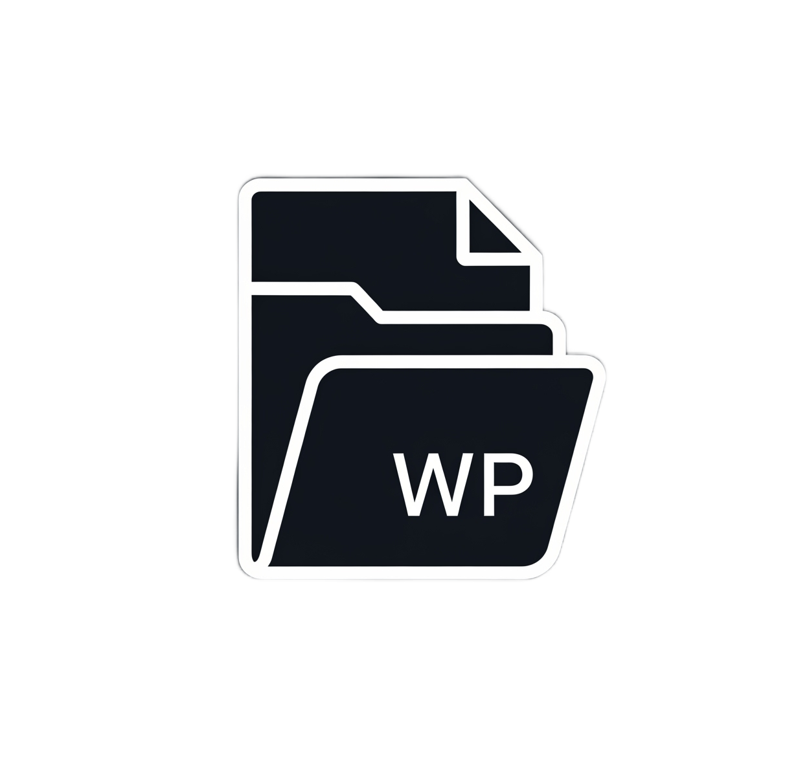

  

_A user-friendly, object-oriented wrapper for the native WordPress Filesystem API. Ensures reliable and portable file 
operations, fully compliant with WordPress core principles_.

# WP File System

`WP File System` is a plugin library created for the entire WordPress developer community. It is indispensable not only
for plugin and theme authors but also for technical specialists involved in deploying, maintaining, and customizing 
sites, as well as for anyone who actively works with the WordPress filesystem during development.

Its philosophy is to solve one of the most common and complex problems in the WordPress ecosystem: 
**reliable and secure file operations.** This problem has two aspects:

1.  **Direct use of PHP functions:** Functions like `file_put_contents`, `mkdir`, or `unlink` are a source of
instability. Code written with them becomes brittle and environment-dependent, often leading to fatal errors due to 
incorrect file permissions or specific hosting security configurations.

2.  **Using third-party libraries:** Many developers try to solve this issue by integrating popular packages like
`symfony/filesystem` or Laravel components. Despite their high quality, they become a "foreign element" in the WordPress
context. These libraries are **unaware of the WordPress Filesystem API's existence**. They bypass the built-in WordPress
mechanisms, ignoring the required file access method (`direct`, `ftp`, `ssh2`) that WordPress selects to ensure security
and server compatibility. This leads to the same permission issues and makes secure interaction with the WordPress 
core—for example, during extension installation or updates—impossible.

`WP File System` solves both of these problems. It provides a simple, unified, and object-oriented interface that serves
as a convenient wrapper for the native `WP_Filesystem` API. The library handles all the complexity: it automatically 
initializes the filesystem, determines the correct access method, manages credentials, and ensures proper permissions
are set, freeing the developer from this headache.

Using `WP File System` ensures that your code will be reliable, secure, and truly portable across different hosting 
environments, as it operates **in full compliance with the principles and mechanisms of the WordPress core.**

## Getting started

To get started with the library and explore its features, please refer to our documentation. There you will find a 
detailed guide on installation, configuration, and usage examples.

*   [**Documentation in Russian**](./.github/documentation/ru/README.md)
*   [**Documentation in English**](./.github/documentation/en/README.md)

## Contributing

We welcome and appreciate community contributions to the project's development. If you would like to help with 
development, suggest new ideas, report a bug, or improve the documentation, please review our contribution guide.

*   [**Contribution Guide (RU)**](./.github/documentation/ru/CONTRIBUTING.md)
*   [**Contribution Guide (EN)**](./.github/documentation/en/CONTRIBUTING.md)
